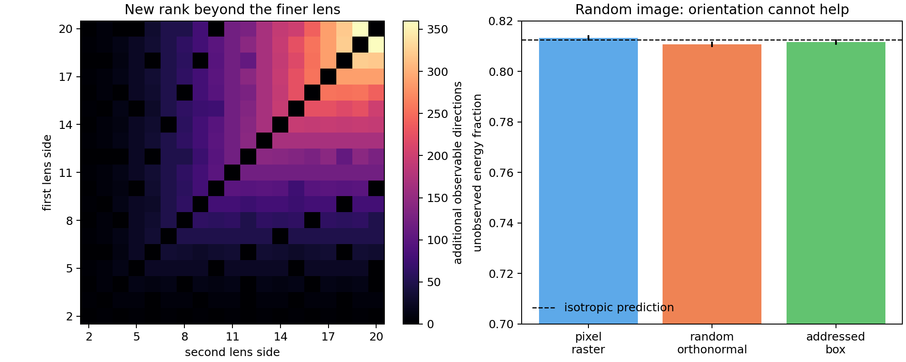
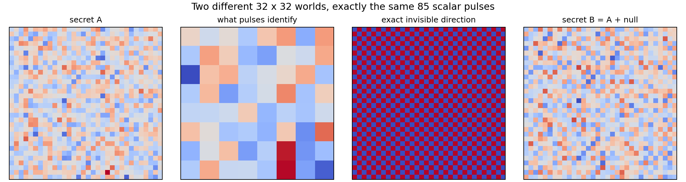
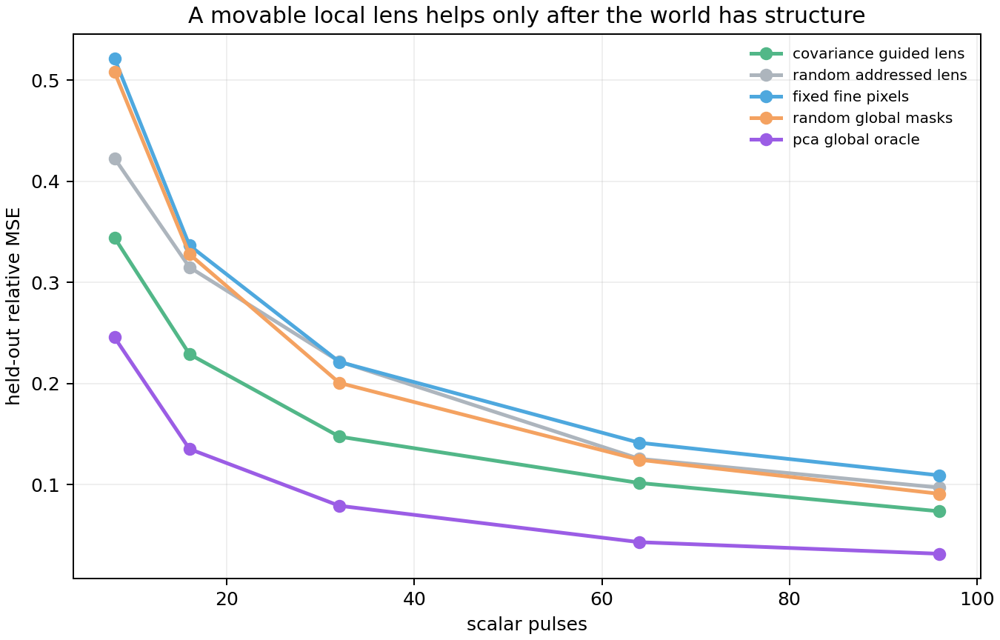
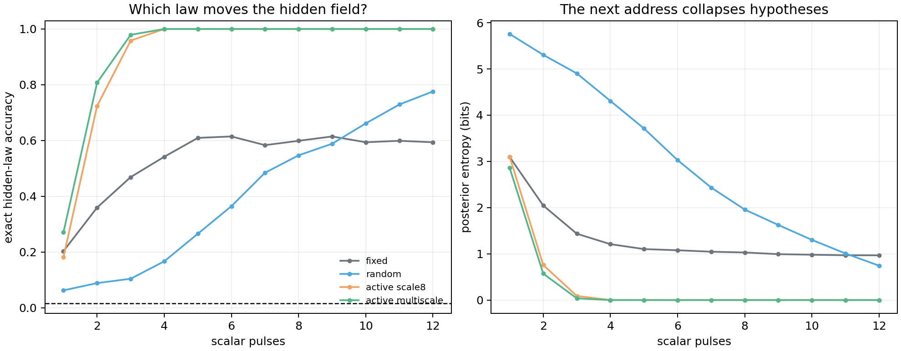

# Geometric Neuron V24 - The Addressable Lens

The old Geometric Neuron accident had a hidden restriction: its readout never moved.

A checkerboard became a vector, a few fixed vector coordinates became a scalar, and a homeostatic controller fed that scalar back into the checkerboard. [V21](https://github.com/anttiluode/GeometricNeuronV21) explained the ECG-like pulse as an aliasing staircase inside a variance thermostat. It also produced the result that matters here: changing `output_dim` and changing which taps were read could change the entire dynamical regime.

V24 removes the thermostat and asks the missing question directly:

> **What can one scalar pulse reveal about a hidden spatial world when the readout can choose where to look and at what scale?**

The minimal object is

```text
address a_t = (scale, row, column)
measurement mask h_a
scalar pulse y_t = h_a^T x_t
```

The pulse alone is not the evidence. The evidence is the history of **address plus pulse**.

This repository is an observability laboratory, not another Perception Lab node pack and not a biological-neuron claim.

## Try the instrument

**[Open the interactive Addressable Lens](https://anttiluode.github.io/GeometricNeuronV24/)**

The page lets you hide a 32 x 32 field, move a box-average lens, choose an address, and receive one scalar. It displays the rank accumulated by the measurement history, the minimum-norm belief, the latest transpose/backprojection, and an exact pair of different worlds that coarse dyadic pulses cannot distinguish.

If GitHub Pages has not yet been enabled, open [`docs/index.html`](docs/index.html) locally.

## What survived the first five gates

| gate | question | result | boundary |
|---|---|---|---|
| **0** | What independent directions can the lens observe? | **Pass.** Nested dyadic grids add redundancy but no rank beyond their finest grid. Non-nested grids add real measurement directions. | A random image still obeys rank. No compression miracle. |
| **1** | Does choosing scale/address help when worlds have repeatable structure? | **Pass.** At 64 pulses, a covariance-guided local lens reduced held-out error by 19.1% versus random addresses and 28.1% versus fixed fine pixels. | A non-local PCA oracle remained much better. |
| **2** | Can pulse + chosen address history identify a hidden dynamical law? | **Controlled pass.** An active observer identified all 64 laws in 192/192 trials after 12 noisy pulses. | The law family and initial field were known; fixed-scale active sensing also reached 100%. |
| **2R** | Does Gate 2 survive new seeds? | The 100% active result repeated on 10/10 seeds. | The original >=0.20 advantage over random passed only 5/10 seeds. Threshold retained, not lowered. |\n| **3A** | Can a write reveal dynamics that read-only observation cannot see? | **Pass.** Four transport laws are exactly identical from zero and after an equal-energy uniform write; a localized write makes them distinguishable. Active addressed reads reached 1.000 exact accuracy versus 0.355 random on the default receipt. | This is a **state write**: it excites the hidden operator but does not alter it. |\n| **3B** | Can a write alter the hidden operator and remain observable after fast-state erasure? | **Pass.** A local retention change remains identifiable after the fast field and write identity are erased. Noise-aware active reads reached 1.000; raw predictive variance 0.367 and random 0.480. | This is a controlled persistent parameter write, not autonomous growth. |\n| **3R** | Does READ+WRITE survive new seeds? | **Pass.** Gate 3A and 3B each passed 10/10 additional seeds. | Finite law families and known diagnostic protocol remain strong constraints. |
| **4** | On real human cell 1125, does moving dendritic stimulation address make hidden local cable parameters more observable at the soma? | **Mixed / informative.** Active addressed probes open the 12-parameter Jacobian from fixed-address rank 2 to full rank 12; random 12-probe sets have median rank 9. | The locked >=90% identity target at 1 uV soma noise **failed 0/10**; active identity is ~0.778 and only 7/12 singular directions clear the 1-uV ruler. |

### Gate 0 - the random image is the null

On a 32 x 32 hidden image (`N = 1024`):

```text
complete dyadic lenses 1,2,4,8,16
rows                                      341
rank                                      256

8 x 8 plus 16 x 16
rank                                      256
gain beyond 16 x 16                         0

15 x 15 plus 16 x 16
rank                                      480
gain beyond 16 x 16                       224
```

The pair result is controlled by the common partition. In the ideal aligned model,

```text
rank([H_r; H_s]) = r^2 + s^2 - gcd(r,s)^2
```

So the precise result behind the tempting phrase "moiré buys rank" is narrower:

> **incommensurate address grids can expose directions hidden from either complete grid alone.**

That does not beat information theory. With 192 independent measurements of an IID random 1024-dimensional image, raster pixels, random orthonormal masks, and the addressed box lens all left the predicted `1 - 192/1024 = 0.8125` fraction of energy unseen:

```text
pixel raster             0.813239
random orthonormal       0.810720
addressed box            0.811538
spread                   0.002519
```



The nullspace is not abstract. Complete scales 1, 2, 4 and 8 supply 85 pulses but only rank 64, leaving a 960-dimensional nullspace. Adding a one-pixel red/blue checkerboard to a random secret changes the image visibly while changing every one of those pulses by only `1.11e-16`.



### Gate 1 - structure is where a policy can matter

Gate 1 generated 768 training and 256 held-out worlds containing smooth blobs, hard edges, and small noise. The detector still returned one scalar. A covariance model could choose only from the same local box addresses; it never saw the held-out secret before choosing its sequence.

At 64 pulses:

```text
covariance-guided local lens       0.101677 relative MSE
random addressed local lens       0.125617
fixed fine pixels                  0.141497
random non-local masks             0.124620
PCA global oracle                  0.043137
```



The lens therefore earns a local structured-world result, not best possible sensing. The global PCA attacker is allowed arbitrary signed non-local masks and wins decisively.

### Gate 2 - infer the generator from its shadow

A known Gaussian seed was evolved by one of 64 hidden laws:

```text
8 directions x 2 speeds x 2 diffusion rates x 2 decay rates
```

At each of 12 moments the observer received one noisy scalar. It could keep one address fixed, move randomly, or select the address at which its remaining hypotheses predicted the most different pulses.

```text
policy                    exact law     direction     posterior entropy
fixed address               0.594          0.620          0.967 bits
random moving address       0.776          0.859          0.743 bits
active scale 8              1.000          1.000          0.000 bits
active multiscale           1.000          1.000          0.000 bits
```



The multiscale observer mostly alternated between scale 2 and scale 16, which is a pleasing coarse/fine strategy. But scale 8 alone also achieved 100%, so this experiment earns **active address selection**, not a unique need for multiscale vision.

The post-gate 10-seed audit is deliberately beside the positive:

```text
active exact accuracy       1.000 mean, 1.000 minimum
random exact accuracy       0.796 mean, 0.760-0.828 range
active - random             0.204 mean, 0.172 minimum
original locked gate        5 / 10 seeds
```

The mechanism replicated. The originally demanded 0.20 margin did not.

## Gate 3 - READ+WRITE: excitation is not modification

Gate 3 finally separates two meanings that the older Geometric Neuron loops mixed together.

**Gate 3A writes the fast state, not the operator.** Four hidden periodic transport laws (north, east, south, west with shared diffusion) all produce exactly the same readout from the zero field. An equal-L2-energy uniform write is still an exact null because every law preserves the uniform field. A localized unit-energy write breaks the symmetry:

```text
read-only max law spread          0
uniform-write max law spread      0
localized-write max law spread    0.680000
active exact identification       1.000
random addressed identification   0.355
```

So the important sentence is not "writing helps." It is:

> **an addressed perturbation can excite a hidden operator in a way that makes previously unobservable dynamics observable.**

**Gate 3B writes the operator itself.** One of four hidden local regions receives a persistent retention change. The fast field is then erased and the write address is withheld. Every hypothesis receives the same public diagnostic load. Later scalar probes can still recover which operator region changed:

```text
no-write max law spread           0
persistent-write max spread       0.075605
noise-aware active accuracy       1.000
raw-variance accuracy             0.367
random accuracy                   0.480
```

The deliberately heteroscedastic detector is a useful attacker. Simply probing where hypotheses have the largest raw spread chases noisy fine-scale channels and performs no better than random. Dividing expected separation by known detector noise recovers the hidden write.

Across seeds 1 through 10, **both Gate 3A and Gate 3B passed 10/10**. See [the Gate 3 experiment](experiments/gate3_read_write.py), [robustness audit](experiments/gate3_robustness.py), and [the neuron-mechanism boundary](docs/NEURON_MECHANISM_BOUNDARY.md).

## Gate 4 - the telescope reaches a real dendritic tree

Gate 4 loads the pinned released human L2/3 **cell 1125** morphology (12,632
point-tree nodes) and builds a passive morphology-graph cable. Twelve real
dendritic sections carry possible hidden 10% leak-density changes. The observer
gets only somatic voltage and may choose 12 stimulation probes from 144
address/cluster-scale candidates.

The strict result is not a clean pass:

```text
fixed address + varying scale     rank  2 / 12    identity 0.372
active point-only                 rank 12 / 12    identity 0.761
active multiscale                 rank 12 / 12    identity 0.779
random multiscale                 rank  9 / 12 median
```

The active Jacobian is algebraically full-rank, but at the locked **1 uV RMS**
soma-noise ruler only **7/12** singular directions are noise-visible. The
original `>=0.90` identity target passed **0/10** post-result noise seeds.

A post-result noise sweep puts the same classifier at 1.000 accuracy at
0.10 uV, 0.977 at 0.25 uV, 0.905 at 0.50 uV, 0.777 at 1 uV, and 0.543 at
2 uV.

Classification:

> **`ADDRESS_OPENS_FULL_RANK_BUT_SOMA_NOISE_LIMITS_IDENTITY`**

That is arguably the more useful neuronal result. Addressed perturbation removes
an **algebraic** ambiguity, but soma-only readout remains an **amplitude**
bottleneck.

Point probes already reach full rank, so multiscale stimulation is not necessary
here. Flattening all dendritic radii to the real-cell median also preserves full
rank and actually improves the worst singular value, so the biological radius
profile is not what earns this effect in the current passive model.

See [Gate 4's full boundary](docs/GATE4_NEURON_OBSERVABILITY.md),
[the experiment](experiments/gate4_cell1125_observability.py), and
[the post-result audit](experiments/gate4_robustness.py).

## Gate 5 - HUMAN NMDA does not rescue the soma bottleneck

Gate 5 froze the exact 12 probe addresses chosen by Gate 4 and changed only
the local input law.

```text
condition             rank   visible @1uV   s_min (mV)     identity

PASSIVE_CURRENT       12/12      7/12       6.3980e-05      0.776
AMPA_ONLY             12/12      7/12       5.2641e-05      0.713
FROZEN_NMDA           12/12      7/12       5.2641e-05      0.713
HUMAN_NMDA            12/12      7/12       5.4218e-05      0.724
```

The HUMAN magnesium feedback adds only **+0.011** exact identity over the
rest-matched frozen-block control and does not add a single noise-visible
direction.

More importantly, it is not selectively rescuing the five weak Gate-4
directions:

```text
median weak-direction gain HUMAN/frozen     1.030x
median strong-direction gain                1.036x
weak / strong selectivity                   0.994x
```

Classification:

> **`HUMAN_NMDA_RESHAPES_BUT_DOES_NOT_RESCUE_SOMA_OBSERVABILITY`**

The AMPA-only and frozen-NMDA controls are algebraically identical under the
locked rest matching and agree to **8.674e-19 mV**. The HUMAN implicit
sensitivity agrees with a direct 10% hidden-leak finite difference to relative
error **0.0002**.

This closes the specific attempted bridge from addressed dendritic stimulation
plus HUMAN NMDA to a high-fidelity central soma observer. It does **not** prove
that neurons cannot communicate local state by other mechanisms.

See [the full Gate 5 boundary](docs/GATE5_NMDA_BRIDGE.md) and
[the experiment](experiments/gate5_nmda_observability.py).

## The adjoint: what V24 uses, and what it does not claim

For a static linear measurement stack `y = Hx`, the squared-error gradient is simply

```text
nabla_x 1/2 ||H x_hat - y||^2 = H^T(H x_hat - y).
```

Gate 0 checks that transpose/backprojection against finite differences (`2.10e-10` relative error). This makes a literal image-space sensitivity map: where would changing the candidate image most change the pulse mismatch?

That is a **software adjoint**. It is not evidence that the old ECG loop or any physical neuron performs backpropagation.

The attached Bösch-Gediz-Türeci paper, *Unifying Physical Backpropagation* (arXiv:2608.11585), asks when the same physical hardware that runs the forward dynamics can also generate its adjoint field. Its conditions and its nonlinear/trajectory obstruction are summarized in [`docs/PHYSICAL_ADJOINT_BOUNDARY.md`](docs/PHYSICAL_ADJOINT_BOUNDARY.md). The paper's theorem belongs to its authors; V24 has not implemented a same-device physical adjoint.

## What changed relative to the old node graph

V24 borrows the question, not the software architecture.

| old ECG loop | V24 |
|---|---|
| checkerboard fully determined by the controller scalar | hidden field has many degrees of freedom independent of the pulse |
| `ceil(sqrt(output_dim))`, then possibly trims a non-square vector | resolution is an explicit square lens side |
| vector normalized by its current maximum | absolute area averages are retained |
| four permanently wired splitter coordinates | address is a recorded experimental action |
| pulse changes checkerboard size immediately | Gate 0 first separates observation from intervention |
| variance thermostat creates the spike | no thermostat in the measurement gates |

V21's diagnosis remains standing: the original ECG loop is a scalar variance thermostat around a quantized aliasing map. V24 does not retroactively rename it memory, cortex, or adjoint machinery.

## Run

```bash
python -m pip install -e .
python -m unittest discover -s tests -v

python experiments/gate0_lens_rank.py
python experiments/gate1_structured_lens.py
python experiments/gate2_rule_sherlock.py
python experiments/gate2_robustness.py
```

Every experiment writes a machine-readable JSON receipt under `results/` and exits nonzero if its own locked gate fails. The robustness audit exits successfully when the mechanism-level replication succeeds while preserving the failed original margin as its scientific classification.

## The next gate - back to PerceptionLab

The neuron bridge has now done its job.

Gate 4 showed that address can open algebraic observability on a real
morphology. Gate 5 showed that the tested HUMAN NMDA feedback does not turn
that severely compressed soma channel into a detailed branch-state observer.

So V24 returns to the synthetic question that was stronger all along:

```text
remember
   |
predict
   |
measure surprise
   |
pay only when surprise/ambiguity justifies another look
   |
move address / lens scale
   |
write the correction back into persistent spatial state
```

The next experiment should make **history change future sensing**. A persistent
local write must reduce the need to re-measure the same recurring surprise;
prediction errors should choose when and where to spend a bounded probe budget.
The attacker is the same active reader with its write memory erased.

This is Geometric Neuron in the old PerceptionLab sense again: addressable
spatial read/write and an active sampling policy, not a claim that a biological
neuron literally implements the software.

See [`METHOD.md`](METHOD.md), [`RESULTS.md`](RESULTS.md), and [`MORGUE.md`](MORGUE.md).

---

**Current boundary:** V24 has earned addressable scalar read/write, active hidden-law identification, persistent operator writes, and a real-morphology observability bridge. The tested HUMAN NMDA law **did not** rescue the weak soma-observability directions. The project now returns to synthetic PerceptionLab-style active sensing rather than adding another biological rescue mechanism.

*Do not hype. Do not lie. Just show.*
